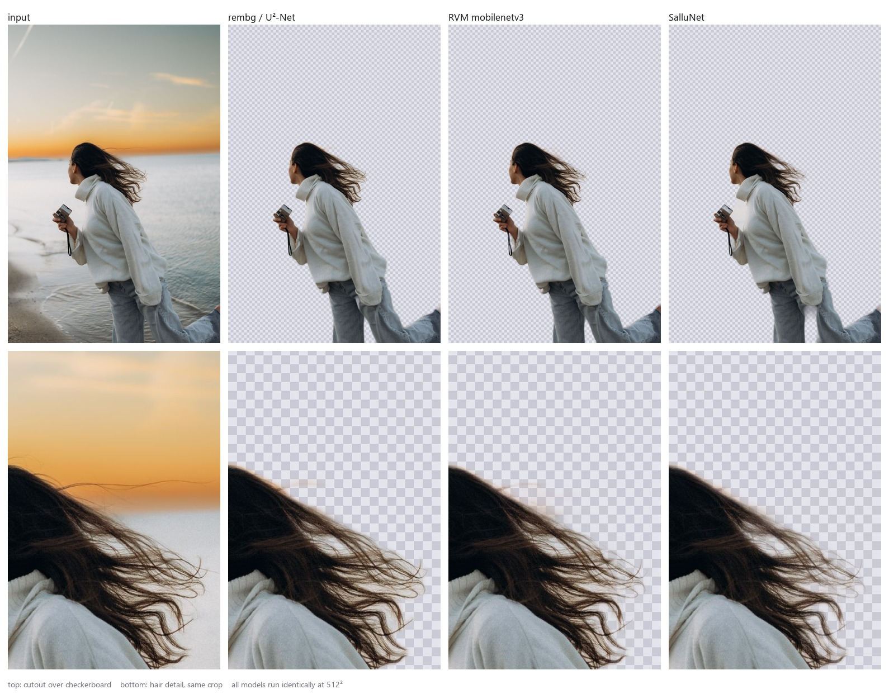
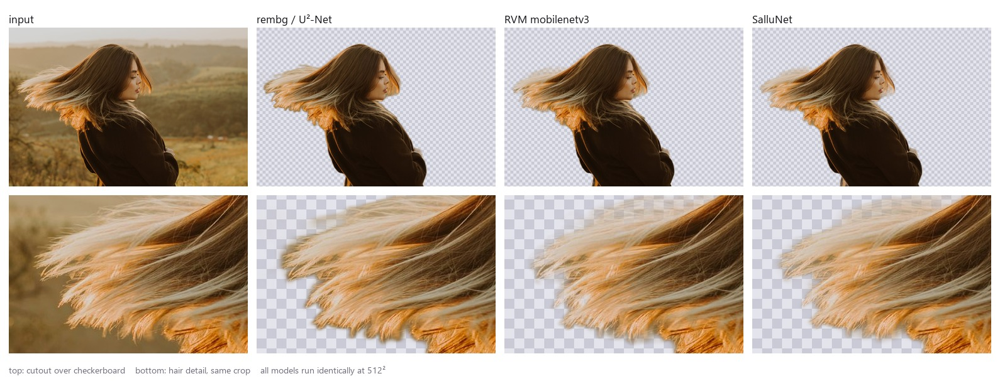
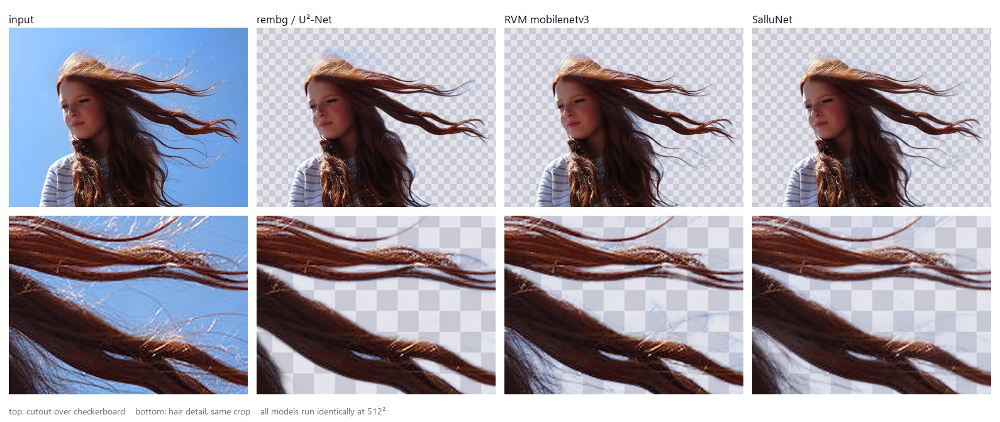
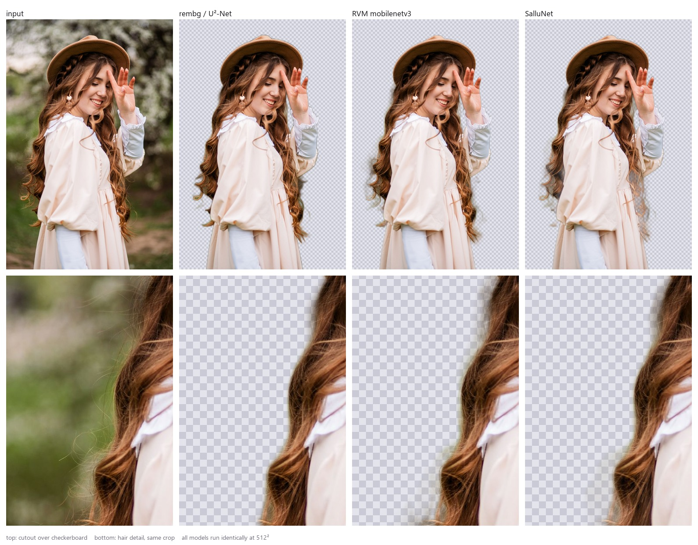

# SalluNet

**A 15 MB background-removal model for people, by [SalluLabs](https://github.com/salmannawaz786).**

Weights on the Hub: **[salluu3432/sallunet](https://huggingface.co/salluu3432/sallunet)**

4.03M parameters, distilled from BiRefNet and trained on ~14k images for about
$33 of serverless GPU.

It is not a general background remover. It handles humans and nothing else,
and that narrowness is the entire reason a 15 MB model can beat a 168 MB one.

---

## Results

All models were run through the **same** evaluation code, at the **same**
resolution, over the **same** 500 held-out images (`P3M-10k / P3M_500_NP`).
Latency is ONNX Runtime on 4 CPU threads.

| model | params | file | band_mad ↓ | grad ↓ | mad ↓ | sad ↓ | latency |
|---|---|---|---|---|---|---|---|
| GT bounding box *(control)* | — | — | 515.43 | 89.58 | 223.99 | 58.72 | — |
| rembg / U²-Net | 44M | 167.8 MB | 248.60 | 44.50 | 26.35 | 6.91 | 420 ms @320² |
| BiRefNet_HR-matting *(teacher)* | 220M | ~900 MB | 163.18 | 34.29 | 12.37 | 3.24 | — |
| RVM mobilenetv3 | 3.7M | 14.3 MB | 165.63 | 32.97 | **11.72** | **3.07** | **178 ms** @512² |
| **SalluNet** | **4.03M** | **15.4 MB** | **136.04** | **30.73** | 20.06 | 5.26 | 376 ms @512² |

`band_mad` is mean absolute alpha error restricted to the soft transition band
(0.05 < α < 0.95) — i.e. **hair**. It is the metric this project optimises for,
because hair is what separates a matting model from a segmentation model.

**SalluNet vs rembg**: better on every metric, 10.9× smaller, and faster despite
processing 2.6× more pixels per frame.

**SalluNet vs RVM**: 18% better hair and better edge structure, but RVM wins
whole-image accuracy and is 2.1× faster. RVM is an extremely well-engineered
model and this project does not beat it outright.

**SalluNet vs its own teacher**: better hair than the 220M model it was distilled
from — because 70% of the training mix was P3M's *human-drawn* alphas, not
teacher pseudo-labels. The student learned from people, not just from a model.

### What that looks like

`band_mad` is an abstraction. This is the thing it measures, on photographs from
outside any of the three models' training data.

Every model runs exactly as `baseline_eval.py` runs it — squashed to 512², alpha
resized back to the original frame, RVM's recurrent states starting at zero. Top
row is the cutout over a checkerboard; bottom row is the same crop of the hair,
enlarged. Reproduce with `python compare_visual.py`.

**Backlit flyaway hair against a sunset.** rembg and RVM both keep a slab of
orange sky as a halo; the strands survive in all three, but only one of them
stops at the hair.



**Hair in motion.** rembg's edge is visibly polygonal — a segmentation boundary
traced around hair rather than through it. RVM softens the boundary into a grey
band. SalluNet resolves individual strands.



**Wind-blown strands against a clean sky**, the easiest possible case for a
segmenter. rembg still drops the thin strands entirely.



**Soft curls against foliage.** The failure modes separate cleanly here: rembg
cuts a hard silhouette, RVM produces a translucent halo the width of the curl,
SalluNet keeps the curl and drops the background.



Two things these pictures do **not** show, and should not be read as showing:

- **Speed.** RVM is 2.1× faster than SalluNet, and these crops say nothing about
  that. The comparison here is quality only.
- **A general win.** On subjects with no soft edge — a headscarf, a bare
  shoulder — all three are indistinguishable, and RVM still beats SalluNet on
  whole-image `mad`/`sad`. The advantage is specifically at the hair boundary.
  Sheets for all twelve test images, including the ones where nothing separates
  the models, are written to `docs/compare/`.

### Caveats that belong next to the numbers

- **This is an in-domain result.** The eval split and 70% of training are both
  P3M. rembg, RVM and the teacher never saw it. The win is real but flattered.
- **`sad` is not comparable to published P3M figures.** SAD is a sum over
  pixels; these are measured at 512², published numbers usually at native
  resolution. Only the within-table comparison is meaningful.
- **`mad` and `sad` are not reliable at this scale.** A replicate run measured
  their run-to-run variance at 17%; `band_mad` and `grad` sit at ~2%. See
  *What the numbers can and cannot say*.
- Evaluation squashes images to square, which distorts portrait aspect ratios.
  Applied identically to every model, so the ranking holds, but it is a flaw.

---

## How it works

**Student** — MobileNetV4-conv-small encoder, a 224-channel FPN decoder run to
stride 2, and a shallow full-resolution detail branch that predicts a *residual*
on top of the semantic prediction. Zero-initialised, so training starts from the
semantic output and learns edges from there.

**Why the split**: locating a person needs receptive field and tolerates low
resolution; resolving a hair edge needs resolution and almost no receptive
field. One head cannot do both — predicting alpha from strided features alone
produces the blobby silhouettes this project set out to avoid.

**Loss** — band-weighted L1 (transition pixels weighted 10×) + Sobel gradient
loss + Laplacian pyramid loss + a direct term on the coarse head. Without the
band weighting a model scores well by predicting a clean silhouette and ignoring
hair entirely, which is exactly the failure mode being designed against.

**Data** — 13,764 training pairs:

| source | pairs | labels |
|---|---|---|
| P3M-10k | 9,420 | human-annotated alpha |
| COCO *person* | 4,344 | pseudo-labelled by BiRefNet_HR-matting |

COCO images were filtered (person 15–98% of frame, ≤2 people, min side 480px),
pseudo-labelled, then **gated by dilated COCO person polygons** to remove held
objects, and finally filtered again on teacher-confidence signals. 50% of
candidates were rejected.

---

## What the numbers can and cannot say

Seven variants were trained. Six scored worse than the one that shipped:

| run | change from v1 | band_mad | outcome |
|---|---|---|---|
| **v1** | — | **136.2** | shipped |
| v2 | heavier augmentation + `w_coarse` 0.5 | 204.1 | worse |
| v3 | stride-4 decoder + `detail_ch` 32 | 163.3 | worse |
| v4 | stride-4 decoder only | 166.1 | worse |
| v5 | v4 + `band_weight` 4 | 169.3 | worse |
| v6 | `band_weight` 4, 12k schedule | 164.4 | worse |
| v7 | `band_weight` 4, 30k schedule | 144.5 | worse |

Rather than assume those differences were real, v1 was **re-trained with an
identical configuration** (`v1r`) to measure the noise floor directly. The two
runs differ only in random weight initialisation — the data pipeline is
deterministic, since `ShardDataset` seeds from `step`, which is 0 on every fresh
run.

| metric | v1 | v1r | run-to-run variance |
|---|---|---|---|
| band_mad | 136.25 | 138.98 | **2.0%** |
| grad | 30.84 | 31.03 | **0.6%** |
| mad | 20.57 | 24.04 | **16.9%** |
| sad | 5.39 | 6.30 | **16.9%** |

**The metrics have very different noise floors, and it changes which
conclusions survive.**

`band_mad` and `grad` are reliable to ~2%. `mad` and `sad` are not — two runs of
the *same* configuration differ by 17% on them. The reason is structural:
`band_mad` is normalised over the transition band only, while `sad`/`mad` are
whole-image aggregates dominated by large flat regions where tiny per-pixel
differences accumulate.

So:

- **Conclusions that stand.** The stride-2 decoder is genuinely the best
  configuration tested — the 20% `band_mad` gap to the stride-4 runs is 10× the
  noise floor. v1 is reproducible within 2%, so the headline is not a lucky
  draw. The 18% hair advantage over RVM is far outside noise.
- **Conclusions that collapse.** Every `band_weight` result. It "improved" `mad`
  43% in the v4/v5 pair and made it 33% *worse* in the v1/v7 pair — both single
  runs on a metric with a ±17% floor, which is exactly why they disagreed. The
  `mad` gap to RVM (71%) is still real at 4× the floor, but nothing in this
  project measured a way to close it.

The broader lesson: several regressions in the table above were diagnosed, given
mechanisms, and "fixed" before anyone checked whether the metric could resolve
them. **Measure the noise floor before interpreting a difference.**

---

## Things that were tried and did not work

Documented because the negative results were expensive and are more informative
than the successes.

**1024² fine-tuning made the model worse** (`band_mad` 136 → 159 at 1024, → 261
at 512). Root cause: shards are stored at max 1024 on the long side, and the
training crop takes 50–100% of that and resizes *up* to 1024. The model was
being trained on 2× upsampled blur and learned to reproduce interpolation
artifacts. Real high-resolution training needs higher-resolution *sources*;
P3M originals are ~1000px and COCO ~640px, so the pixels do not exist.

**INT8 quantization destroyed quality.** Static QDQ was 1.6× faster but
`band_mad` went 136 → 273, worse than rembg. Dynamic quantization was 2.6×
*slower* — onnxruntime's dynamic path accelerates MatMul, which a convnet
barely uses. Matting regresses a continuous alpha and all the quality lives in
the soft transition band; INT8 quantises exactly that band into coarse levels.
Classification tolerates this, matting does not.

**Heavier augmentation was 43% worse.** Rotation stamps artificial black corners
into both image and alpha, and background replacement is only an approximation
(the true foreground colour is unknown, so compositing reuses the observed
pixel) — at high probability it teaches the model that hair always carries a
colour fringe.

**The first teacher choice was wrong and cost a full labelling pass ($3.24).**
BiRefNet (base) is a *salient object* segmenter, not a human matter: it happily
included a pizza the subject was holding. A bake-off had been run, but it tested
"does it segment the right object" and never tested "is the hair soft" — the
property the entire project depends on. Testing the wrong thing is as expensive
as not testing.

**Two tuning experiments were wasted optimising a model that was already the
best thing on the benchmark**, because no baseline had been measured. `band_mad
136` is meaningless without knowing that rembg scores 249 and the teacher 163.
Measure baselines *before* tuning.

---

## Reproducing

Stages are independently resumable — every unit of work writes a `.done` marker
after its output is safely on disk, so an interrupted run re-scans and skips
what finished. A crash costs at most one shard.

```bash
modal run stage1_fetch.py::main          # COCO person subset  (CPU, ~2 min)
modal run stage1b_p3m.py::main           # P3M-10k             (CPU, free)
modal run stage2_label.py::main          # teacher labelling   (H100, ~$2.20)
python launch.py v1                      # student training    (A100, ~$2.60)
modal run evaluate.py::compare           # held-out metrics
modal run baseline_eval.py::main         # rembg / RVM / teacher / control
modal run export_bench.py::main          # ONNX + CPU latency
python compare_visual.py --images testdata --rvm rvm.onnx  # the sheets above
```

GPU is used only where a neural network actually runs — labelling and training.
Downloading, filtering, packing and compositing are CPU, parallel, and
effectively free.

**Total cost: ~$30**, of which roughly $8 was avoidable (a discarded labelling
pass, an overlong first training run, and experiments run below the noise
floor).

---

## Licence and provenance

Code: MIT. The model is **distilled from BiRefNet_HR-matting** (MIT) and trained
partly on P3M-10k (MIT) — it is not trained from scratch, and that framing is
deliberate. P3M is a privacy-preserving dataset with deliberately blurred faces;
COCO supplies the unblurred faces in the mix.
